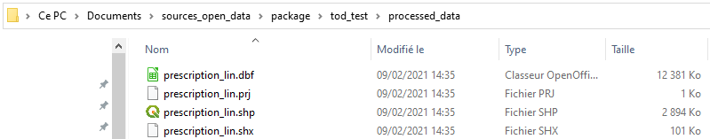

```{r setup, include = FALSE}
knitr::opts_chunk$set(
  collapse = TRUE,
  cache = FALSE,
  comment = "#>"
)
```

Les étapes de configuration de la machine et d'installation des packages sont considérées comme déjà réalisées.

Activation des `packages`.

```{r, message = FALSE, warning = FALSE}
library(tod)
library(tidyverse)
```

# Contenu

Le [Géoportail de l'Urbanisme](https://www.geoportail-urbanisme.gouv.fr/) offre des [services de téléchargement, de consultation ainsi que des API](https://www.geoportail-urbanisme.gouv.fr/services/).

Les couches SIG proposées sont les suivantes :

- document
- municipality
- zone_urba
- secteur_cc
- prescription_lin
- prescription_pct
- prescription_surf
- info_lin
- info_pct
- info_surf

Elles peuvent être utilisées en flux WMS ou bien téléchargées. La volumétrie est toutefois importante dès lors que l'emprise géographique est conséquente (un département ou une région), ce qui ralentit le flux. Sur de telles emprises géographiques il est donc plus facile de télécharger les données pour travailler en local.

Les étapes de chargement, mise en forme et d'exportation peuvent être soit réalisées pas à pas, soit enchaînées en utilisant une fonction intégratrice comme `ign_urba_api_shp()`, qui produit directement un shapefile à partir de la requête.

# Etape par étape

## Téléchargement

L'exemple donné consiste à télécharger les prescriptions linéaires, nommées "prescription_lin" sur le géoportail. On conserve par défaut le répertoire de stockage des données brutes `("raw_data/prescription_surf")`.

L'emprise géographique est définie par un cadre rectangulaire de coordonnées WGS84 (en degrés, point décimal). Les longitudes ouest sont en négatif. 

```{r, eval = FALSE}
tod::ign_urba_tod(couche = "prescription_lin",
                  xmin = -7,
                  ymin = 47.2,
                  xmax = -4.2,
                  ymax = 48)
```

```{r, echo = FALSE, eval = TRUE}
tod::ign_urba_tod(couche = "prescription_lin",
                  xmin = -6.3,
                  ymin = 47.2,
                  xmax = -4,
                  ymax = 48,
                  repertoire = "../raw_data/prescription_lin")
```

Il se peut qu'au bout d'un moment un message d'erreur "HTTP error 502" ou "504" vous soit retourné. 


Dans ce cas des codes erreurs dans la gamme des 500, c'est le serveur qui n'a pas réussi à traiter correctement votre requête ou que la connexion est mauvaise. Normalement en recommençant ça finit par passer. 

A l'issue du téléchargement, on peut vérifier que les fichiers compressés sont bien à leur place.


## Décompression des archives `.zip`

Il suffit d'indiquer à la fonction `ign_urba_dec()` le chemin vers le répertoire où sont les fichiers compressés.

```{r, eval = FALSE}
ign_urba_dec(repertoire = "raw_data/prescription_lin")
```

```{r, echo = FALSE}
ign_urba_dec(repertoire = "../raw_data/prescription_lin")
```
A l'issue de l'étape, qui est rapide, on peut vérifier que tout s'est bien déroulé. Il doit y avoir un sous-répertoire par fichier `.zip`.


Ici il apparaît qu'un des fichiers `.zip` ne pèse que 2Ko. En fait il contient un shapefile vide. Il faut le supprimer pour éviter des soucis ultérieurs. La fonction `ign_urba_net_rep()` nettoie le répertoire en supprimant tous les sous-répertoires dans lesquels le shapefile pèse moins que le seuil `seuil_ko` en kilo-octets.

```{r, eval = FALSE}
ign_urba_net_rep(repertoire = "raw_data/prescription_lin",
                 seuil_ko = 2)
```

```{r, echo = FALSE}
ign_urba_net_rep(repertoire = "../raw_data/prescription_lin",
                 seuil_ko = 2)
```
## Lecture des shapefiles

La lecture est effectuée avec la fonction `ign_urba_lire_shapes()`.

```{r, eval = FALSE}
sf_liste <- ign_urba_lire_shapes(repertoire = "raw_data/prescription_lin")
```

```{r ign_urba_lire_shapes, echo = FALSE}
sf_liste <- ign_urba_lire_shapes(repertoire = "../raw_data/prescription_lin")
```
Dans cet exemple, la liste contient 2 objets qui contiennent chacun un certain nombre d'objets géographiques (`features`). 


Si l'on clique dessus on en sait plus :


Le premier des éléments de la liste contient 10 000 objets (ce qui correspond à l'argument par défaut `nb_elements_par_telech = 10000` de la fonction de téléchargement `ign_urba_tod`) et le second 2 831 objets. Ils contiennent chacun 14 colonnes dont une contient la géométrie. Les autres colonnes sont les données attributaires.

A ce stade on peut visualiser, par exemple le premier des éléments de la liste, que l'on sélectionne au moyen de crochets `[]`.

NB : la fonction `mapview()` du package `mapview` n'est pas adaptée pour les objets géographiques trop volumineux.

```{r, eval = FALSE}
mapview::mapview(sf_liste[1])
```

## Assemblage des shapefiles

Les objets de la liste ayant tous les mêmes 14 colonnes, il est possible de les assembler en les "empilant" au moyen de la fonction `ign_urba_assembler_sf()`.

```{r assemblage}
assemblage <- ign_urba_assembler_sf(liste_sf = sf_liste)
```

Pour visualiser (si pas trop gros) :

```{r, eval = FALSE}
mapview::mapview(assemblage)
```

## Sauvegarde du shapefile assemblé


```{r, eval = FALSE}
fichier_donnees_traitees <- "processed_data/prescription_lin.shp"
```

```{r, echo = FALSE}
fichier_donnees_traitees <- "../processed_data/prescription_lin.shp"
```

```{r}
ign_urba_sauver_shape(objet_sf = assemblage,
                      chemin = fichier_donnees_traitees,
                      scr = 2154)
```


# Traitement en une seule étape

Il est possible d'enchaîner toutes les étapes décrites ci-dessus en une seule opération au moyen de la fonction `ign_urba_api_shp()` qui va directement produire le shapefile assemblé. L'avantage est que c'est simple et direct, tant que ... tout va bien. En cas de problème intermédiaire, il est plus facile de le résoudre en procédant par étapes.

Exemple sur les prescriptions non plus linéaires mais surfaciques.

```{r, echo = FALSE}
ma_couche <- "prescription_surf"
repertoire_donnees_brutes <- "../raw_data/prescription_surf"
fichier_donnees_traitees <- "../processed_data/prescription_surf.shp"
```

```{r, eval = FALSE}
ma_couche <- "prescription_surf"
repertoire_donnees_brutes <- "raw_data/prescription_surf"
fichier_donnees_traitees <- "processed_data/prescription_surf.shp"
```

```{r, echo = FALSE}
# ign_urba_api_shp(couche = ma_couche,
#                   xmin = -7,
#                   ymin = 47.5,
#                   xmax = -4.5,
#                   ymax = 48,
#                   repertoire = repertoire_donnees_brutes,
#                   fichier_sortie = fichier_donnees_traitees,
#                   scr = 2154)
```


```{r ign_urba_api_shp, eval = TRUE}
ign_urba_api_shp(couche = ma_couche,
                  xmin = -7,
                  ymin = 47.5,
                  xmax = -4.2,
                  ymax = 48,
                  repertoire = repertoire_donnees_brutes,
                  fichier_sortie = fichier_donnees_traitees,
                  scr = 2154)
```

Le résultat se retrouve par défaut dans le répertoire "processed_data" :


