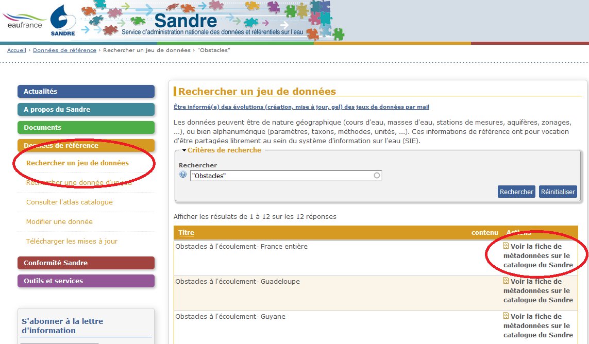
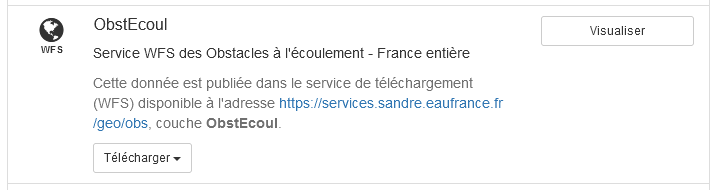
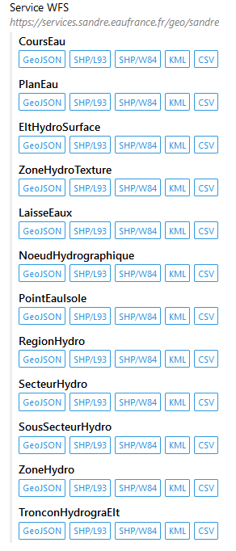
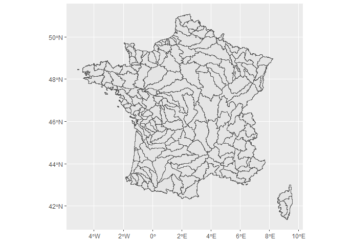

```{r setup, echo = FALSE}
knitr::opts_chunk$set(
  collapse = TRUE,
  cache = FALSE,
  comment = "#>",
  warning = FALSE,
  message = FALSE,
  comment = FALSE
)
```

# Objectif du tuto

Il s'agit de montrer comment accéder simplement à une masse de "lots de données de référence" disponibles via le flux WFS du Sandre avec le logiciel R et de la fonction `tgeo_wfs_sandre()` du package `tod`.

# Les données Sandre

Pour s'y retrouver parmi les données diffusées sur le portail du Sandre, il est utile de se reporter à [cette page](https://www.sandre.eaufrance.fr/actualite/evolution-des-services-web-g%C3%A9ographiques). Ces référentiels géographiques concernent les thèmes suivants :

```{r, eval = T, echo = F}
library(tod)
library(tidyverse)
library(mapview)

read.csv2("../assets/flux_sandre.csv") %>% 
  DT::datatable()
```

Les possibilités de sélection géographique sont limitées. Elles s'opèrent en rajoutant un suffixe au nom de la couche. Par exemple, pour les obstacles à l'écoulement, qu'on peut trouver par le moteur de recherche du site :

https://www.sandre.eaufrance.fr/Rechercher-un-jeu-de-donnees?keyword=%22Obstacles%22



On peut lire sur la fiche de métadonnées que le nom de la couche est **ObstEcoul**, ce qui renvoie les données métropole et DROM.



Si l'on ajoute un suffixe on peut ne charger que :

- la métropole (**ObstEcoul_FXX**)
- la Guadeloupe (**ObstEcoul_GLP**)
- etc.

# Configuration machine

Les étapes de configuration de la machine et d'installation des packages sont considérées comme déjà réalisées. Si ce n'est pas le cas se reporter à [ces explications](https://rpubs.com/kamoke/723467).

Activation des `packages` :

```{r, eval = F, message=F, warning=F}
library(tod)
library(tidyverse)
library(mapview)
```


# Banque Nationale des Prélèvements d'eau (BNPE)

On peut accéder aux couches relatives aux ouvrages et aux points de prélèvement.

```{r, eval = F}
bnpe_ouvrages <- tgeo_wfs_sandre(url_wfs = "https://services.sandre.eaufrance.fr/geo/prl",
                                 couche = "OuvragePrel")

bnpe_points_prel <- tgeo_wfs_sandre(url_wfs = "https://services.sandre.eaufrance.fr/geo/prl",
                                    couche = "PointPrelevement")
```


# Référentiel des obstacles à l'écoulement (ROE)

```{r, eval = F}
obstacles_ecoulement <- tgeo_wfs_sandre(url_wfs = "https://services.sandre.eaufrance.fr/geo/obs",
                                        couche = "ObstEcoul")
```


# Hydroécorégions

Chargement :

```{r, eval = T}
her2 <- tgeo_wfs_sandre(url_wfs = "https://services.sandre.eaufrance.fr/geo/mdo?",
                        couche = "Hydroecoregion2")
```

Affichage :

```{r, eval = T}
ggplot(her2) +
  geom_sf()
```

# Les couches de la base TOPAGE

Les bassins hydrographiques :

```{r, eval = T}
bassins_hydro <- tgeo_wfs_sandre(url_wfs = "https://services.sandre.eaufrance.fr/geo/topage?",
                                 couche = "BassinHydrographique_FXX")

ggplot(bassins_hydro) +
  geom_sf()
```

D'autres couches (certaines, dépassant 100Mo, sont longues à télécharger si votre connexion est faiblarde).

```{r, eval = F}
bv_topo <- tgeo_wfs_sandre(url_wfs = "https://services.sandre.eaufrance.fr/geo/topage?",
                           couche = "BassinVersantTopographique_FXX")


cours_deau <- tgeo_wfs_sandre(url_wfs = "https://services.sandre.eaufrance.fr/geo/topage?",
                              couche = "CoursEau")

plans_deau <- tgeo_wfs_sandre(url_wfs = "https://services.sandre.eaufrance.fr/geo/topage?",
                              couche = "PlanEau")
```

# BD CarTHAgE

La [BD CarTHAgE](https://geo.data.gouv.fr/fr/datasets/82a7d05cc2e7bc060a62ba958728360f12a4a529) (Base de Données sur la CARtographie THématique des AGences de l'eau et du ministère chargé de l'environnement) est antérieure à Topage mais contient certaines informations complémentaires :



Par exemple pour le découpage hydrographique en "secteurs hydrographiques", plus fin que les "bassins hydrographiques" de Topage ci-dessus : 

```{r, eval = FALSE}
bv <- tod::tgeo_wfs_sandre(url_wfs = "https://services.sandre.eaufrance.fr/geo/sandre",
                                      couche = "SecteurHydro_FXX")

bv %>% 
  ggplot() +
    geom_sf()
```



# Les stations et sites hydrométriques

Ce sont les stations où sont effectuées les mesures de débit consultables via la banque HYDRO :

```{r, eval = FALSE}
stations_hydro <- tgeo_wfs_sandre(url_wfs = "https://services.sandre.eaufrance.fr/geo/hyd?",
                                  couche = "StationHydro")

sites_hydro <- tgeo_wfs_sandre(url_wfs = "https://services.sandre.eaufrance.fr/geo/hyd?",
                               couche = "SiteHydro")
```


# Entités hydrogéologiques

Exemple de Mayotte :

```{r, eval = FALSE}
entites_hydrogeol_myt <- tgeo_wfs_sandre(url_wfs = "http://services.sandre.eaufrance.fr/geo/saq?",
                                         couche = "EntiteHydroGeol_MYT")

mapview::mapview(entites_hydrogeol_myt, alpha.regions = 0.01)
```


# Contrats de milieu (contrats de rivière)

```{r, eval = FALSE}
cdm <- tgeo_wfs_sandre(url_wfs = "https://services.sandre.eaufrance.fr/geo/zpl?",
                       couche = "ContratMilieu_FXX")
```

